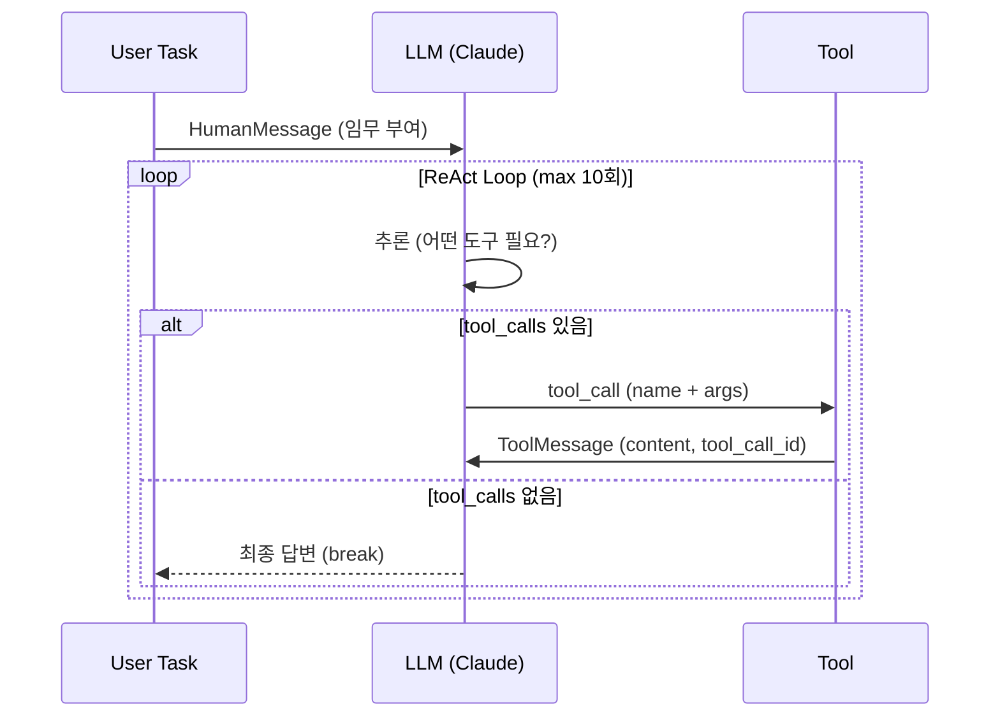

# 실습 2-1: 순수 Agent Loop (LangChain 없이 직접 구현)

> 출처: [[26-03-11 ai-agent-framework-mastering]] — Module 2, 실습 2-1
> 파일: `module2_langchain/01_agent_loop.py`

---

## 핵심 개념

**ReAct 패턴을 손으로 구현**한 실습. 프레임워크 없이 Claude API만으로 "생각 → 도구 선택 → 실행 → 결과 반영" 루프를 돌린다.

- LLM이 `tool_calls`를 반환하면 → 직접 실행 → `ToolMessage`로 결과 주입
- `max_iterations` 안전장치로 무한루프 방지
- 프레임워크가 내부적으로 하는 일을 눈으로 확인할 수 있다

---

## 코드 구조 분해

### 1. 도구 정의
```python
tools = [check_inbox, send_email, search_emails]
tool_map = {t.name: t for t in tools}
```
- `tool_map`: 이름 → 함수 딕셔너리. LLM이 반환한 tool 이름으로 즉시 함수 조회 가능

### 2. 메시지 리스트 누적
```python
messages = [SystemMessage(...), HumanMessage(content=task)]
```
- `messages` 리스트에 대화 전체를 순서대로 쌓는다
- 다음 반복에서 이전 맥락이 모두 포함된 채로 LLM 호출

### 3. 루프 핵심 로직
```python
for i in range(max_iterations):
    response = llm.invoke(messages)
    messages.append(response)          # AIMessage 추가

    if not response.tool_calls:        # 도구 없으면 완료
        break

    for tc in response.tool_calls:
        tool_fn = tool_map[tc["name"]]
        result = tool_fn.invoke(tc["args"])
        messages.append(ToolMessage(
            content=str(result),
            tool_call_id=tc["id"]      # ← 필수! LLM이 응답 매칭에 사용
        ))
```

### 4. tool_call_id의 역할
LLM이 여러 도구를 동시에 요청할 수 있다. `tool_call_id`로 "어떤 요청의 결과인지" 정확히 매핑한다.

---

## 실행 흐름



---

## 설계 포인트

| 포인트 | 설명 |
|--------|------|
| **messages 누적** | 전체 대화 맥락을 LLM에 매번 전달 (stateless API를 stateful하게 사용) |
| **tool_call_id** | 멀티 도구 동시 호출 시 결과 매칭을 위한 필수 필드 |
| **max_iterations** | 무한루프 방어선. 실제 프로덕션에서는 10~20이 적당 |
| **break 조건** | `response.tool_calls`가 비어있으면 LLM이 스스로 완료 판단 |

---

## LangChain/LangGraph와 비교

| 구분 | 이 실습 (순수) | LangGraph (실습 2-2) |
|------|-------------|---------------------|
| 루프 제어 | 직접 for문 | StateGraph가 자동 |
| 상태 관리 | messages 리스트 | AgentState TypedDict |
| 확장성 | 낮음 | 높음 (조건부 엣지 등) |
| 학습 가치 | 내부 동작 이해 | 프로덕션 패턴 |
