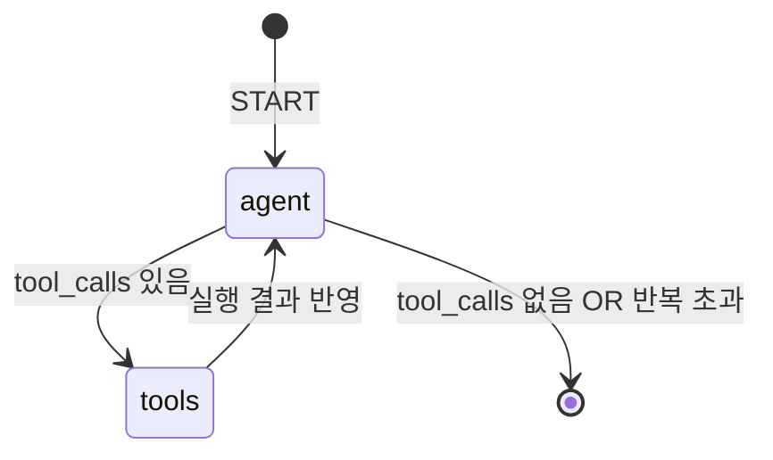

# 실습 2-2: LangGraph 상태 머신

> 출처: [[26-03-11 ai-agent-framework-mastering]] — Module 2, 실습 2-2
> 파일: `module2_langchain/02_langgraph_agent.py`

---

## 핵심 개념

실습 2-1의 수동 루프를 **LangGraph StateGraph**로 재구현. LangGraph는 에이전트 실행 흐름을 **노드(함수) + 엣지(분기 규칙)의 그래프**로 선언적으로 정의한다.

- `AgentState` TypedDict로 공유 상태 정의
- `add_messages` reducer로 messages 자동 병합
- `conditional_edges`로 도구 호출 여부에 따라 분기
- `iteration_count`로 무한루프 방어

---

## 코드 구조 분해

### 1. 상태 정의
```python
class AgentState(TypedDict):
    messages: Annotated[list, add_messages]  # reducer: 자동으로 append
    iteration_count: int
```
- `add_messages`: LangGraph 내장 reducer. 새 메시지가 오면 덮어쓰지 않고 **누적(append)** 처리
- `iteration_count`: 직접 관리하는 카운터. 루프 횟수 제한에 사용

### 2. 노드 함수
```python
def call_model(state: AgentState) -> AgentState:
    response = llm.invoke(state["messages"])
    return {
        "messages": [response],          # add_messages가 기존 리스트에 append
        "iteration_count": state["iteration_count"] + 1
    }

def call_tools(state: AgentState) -> AgentState:
    tool_results = tool_node.invoke(state)  # ToolNode가 자동으로 모든 tool_call 실행
    return tool_results
```

### 3. 그래프 조립
```python
workflow = StateGraph(AgentState)
workflow.add_node("agent", call_model)
workflow.add_node("tools", call_tools)

workflow.add_edge(START, "agent")
workflow.add_conditional_edges("agent", should_continue)  # 분기 함수
workflow.add_edge("tools", "agent")   # 도구 실행 후 다시 agent로
```

### 4. 조건 분기 함수
```python
def should_continue(state: AgentState) -> str:
    last_msg = state["messages"][-1]
    if state["iteration_count"] >= max_iterations:
        return "end"
    if last_msg.tool_calls:
        return "tools"
    return "end"
```

---

## 실행 흐름



---

## ToolNode의 역할

`ToolNode(tools)`는 LangGraph가 제공하는 헬퍼. 내부적으로:
1. `state["messages"][-1].tool_calls` 에서 모든 tool call 추출
2. 각 tool을 `tool_map`에서 찾아 실행
3. 결과를 `ToolMessage` 리스트로 반환

실습 2-1에서 직접 작성했던 tool 실행 루프를 ToolNode 한 줄로 대체.

---

## 설계 포인트

| 포인트 | 설명 |
|--------|------|
| **선언적 그래프** | 흐름 제어 로직이 엣지 정의에 집중 → 코드 가독성↑ |
| **add_messages reducer** | 상태 업데이트 시 메시지 자동 병합, 덮어쓰기 방지 |
| **ToolNode** | 다중 tool call 자동 처리, tool_call_id 매칭 내장 |
| **conditional_edges** | 분기 로직을 별도 함수로 분리 → 테스트 가능 |

---

## 실습 2-1 vs 실습 2-2

| 항목 | 2-1 (순수 루프) | 2-2 (LangGraph) |
|------|----------------|-----------------|
| 루프 제어 | `for i in range(...)` | `StateGraph` + 엣지 |
| 도구 실행 | 직접 `tool_map[name].invoke()` | `ToolNode` 자동 처리 |
| 상태 | `messages` 리스트 | `AgentState` TypedDict |
| 체크포인팅 | 불가 | `MemorySaver` 추가로 가능 |
| 시각화 | 불가 | `graph.get_graph().draw_mermaid()` |
