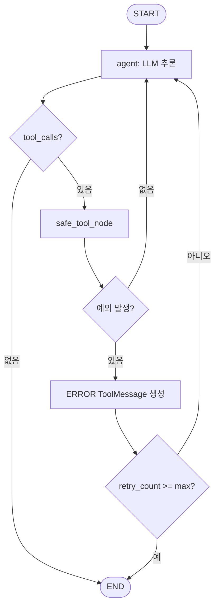

# 실습 2-3: 에러 핸들링과 재시도

> 출처: [[26-03-11 ai-agent-framework-mastering]] — Module 2, 실습 2-3
> 파일: `module2_langchain/03_retry_control.py`

---

## 핵심 개념

프로덕션 에이전트의 핵심 과제: **도구가 실패해도 에이전트가 죽지 않아야 한다.**

3겹 방어막 구조:
1. `safe_tool_node`: 예외를 잡아 에러 메시지로 변환 (크래시 방지)
2. `retry_count` / `max_retries`: 상태에서 재시도 횟수 추적
3. LLM Instructions: 실패 상황을 사용자에게 설명하도록 유도

---

## 코드 구조 분해

### 1. AgentState에 재시도 카운터 추가
```python
class AgentState(TypedDict):
    messages: Annotated[list, add_messages]
    retry_count: int
    max_retries: int
    iteration_count: int
```

### 2. safe_tool_node — 핵심 방어 레이어
```python
def safe_tool_node(state: AgentState) -> AgentState:
    try:
        result = tool_node.invoke(state)
        return result
    except Exception as e:
        # 크래시 대신 에러를 ToolMessage로 변환
        error_msg = ToolMessage(
            content=f"ERROR: {str(e)}",
            tool_call_id=state["messages"][-1].tool_calls[0]["id"]
        )
        return {
            "messages": [error_msg],
            "retry_count": state["retry_count"] + 1
        }
```
- 예외가 발생해도 그래프가 계속 실행됨
- LLM은 ERROR 메시지를 받고 → 대안 시도 or 사용자에게 설명

### 3. 50% 랜덤 실패 시뮬레이션
```python
import random

def unreliable_tool(args):
    if random.random() < 0.5:
        raise Exception("네트워크 오류: 임시 실패")
    return "성공 결과"
```
- 실제 환경의 불안정한 API를 시뮬레이션
- 에러 핸들링 로직을 검증하기 위한 테스트 도구

### 4. 분기: 재시도 한계 도달 시 강제 종료
```python
def should_continue(state: AgentState) -> str:
    if state["retry_count"] >= state["max_retries"]:
        return "end"   # 재시도 소진 → 종료
    last_msg = state["messages"][-1]
    if last_msg.tool_calls:
        return "tools"
    return "end"
```

---

## 실행 흐름



---

## 설계 포인트

| 포인트 | 설명 |
|--------|------|
| **예외를 메시지로 변환** | 에이전트 루프가 죽지 않고 에러 정보를 LLM에 전달 |
| **tool_call_id 매핑** | 에러 ToolMessage도 반드시 id 포함 (없으면 LangChain 오류) |
| **재시도 상태 분리** | `retry_count`를 별도 필드로 관리 → 분기 함수에서 명확한 판단 |
| **LLM이 에러를 처리** | LLM이 ERROR 메시지를 받으면 스스로 대안을 선택하거나 포기를 선언 |

---

## 실전 패턴: Exponential Backoff

이 실습은 즉시 재시도지만, 실제 API 오류는 시간이 지나면 해결되는 경우가 많다:

```python
import time

def safe_tool_node_with_backoff(state, attempt=0):
    try:
        return tool_node.invoke(state)
    except Exception as e:
        wait = 2 ** attempt  # 1초 → 2초 → 4초
        time.sleep(wait)
        raise
```

DeepAgents 패턴 04 (`error_handling`)의 `retry_on_failure` 데코레이터와 동일한 개념.
