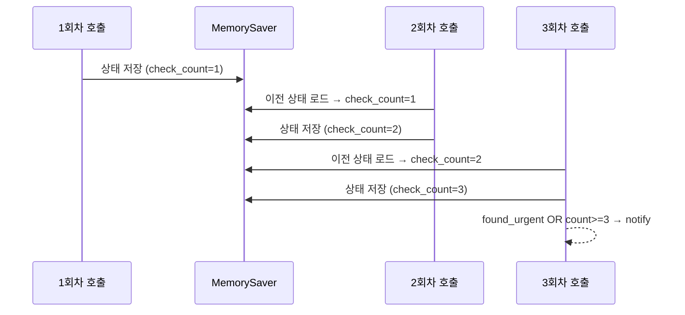

# 실습 2-4: 체크포인팅 Long-Running Agent

> 출처: [[26-03-11 ai-agent-framework-mastering]] — Module 2, 실습 2-4
> 파일: `module2_langchain/04_long_running.py`

---

## 핵심 개념

**체크포인팅(Checkpointing)**: 에이전트 실행 상태를 저장해두어, 나중에 같은 `thread_id`로 재시작하면 이전 맥락이 이어진다.

- `MemorySaver`: 메모리 내 체크포인트 저장소 (프로덕션에서는 Redis/DB로 교체)
- `thread_id` config: 어떤 대화 세션인지 식별하는 키
- 상태가 누적되므로 `check_count` 같은 필드가 **호출 간에 유지**됨

---

## 코드 구조 분해

### 1. MemorySaver 적용
```python
from langgraph.checkpoint.memory import MemorySaver

memory = MemorySaver()
app = workflow.compile(checkpointer=memory)
```
- `compile()` 시 `checkpointer` 인자만 추가하면 체크포인팅 활성화

### 2. thread_id config
```python
config = {"configurable": {"thread_id": "email-monitor-session-1"}}

# 1회차 실행
result1 = app.invoke({"messages": [...], "check_count": 0}, config)

# 2회차 실행 (같은 thread_id → 이전 상태 로드)
result2 = app.invoke({"messages": [...], "check_count": 0}, config)
```
- 같은 `thread_id`로 호출하면 내부적으로 이전 체크포인트를 로드
- 서로 다른 사용자는 다른 `thread_id` 사용 → 세션 격리

### 3. check_count 누적
```python
class AgentState(TypedDict):
    messages: Annotated[list, add_messages]
    check_count: int         # 체크포인트에 저장 → 다음 호출 시 유지
    found_urgent: bool
```

```python
def check_email_node(state):
    return {
        "check_count": state["check_count"] + 1,  # 이전 값에 누적
        ...
    }
```

### 4. OR 로직: 긴급메일 발견 시 즉시 알림
```python
def should_continue(state):
    if state["found_urgent"] or state["check_count"] >= 3:
        return "notify"   # 조건 달성 → 알림
    return "check"        # 조건 미달 → 계속 폴링
```

---

## 실행 흐름



---

## 설계 포인트

| 포인트 | 설명 |
|--------|------|
| **thread_id** | 사용자/세션 식별자. 다른 thread_id = 완전히 독립된 상태 |
| **MemorySaver** | 개발/테스트용. 프로세스 재시작 시 상태 소멸 |
| **Redis/DB 교체** | `SqliteSaver`, `PostgresSaver` 등으로 영속화 가능 |
| **상태 누적 조건** | `add_messages`처럼 reducer를 직접 정의해 어떻게 병합할지 제어 |

---

## 실전 활용: 장기 실행 모니터링

```
시나리오: 1시간마다 이메일 폴링
- cron 또는 scheduler가 매 시간 app.invoke() 호출
- 동일 thread_id 사용 → check_count, found_urgent 상태 유지
- 프로세스 재시작되어도 DB 체크포인터라면 상태 복구
- 조건 달성 시 알림 전송 후 thread_id를 새 값으로 교체 (리셋)
```

DeepAgents 패턴 10 (`session_management`)의 UUID 세션과 결합하면 다중 사용자도 처리 가능.
