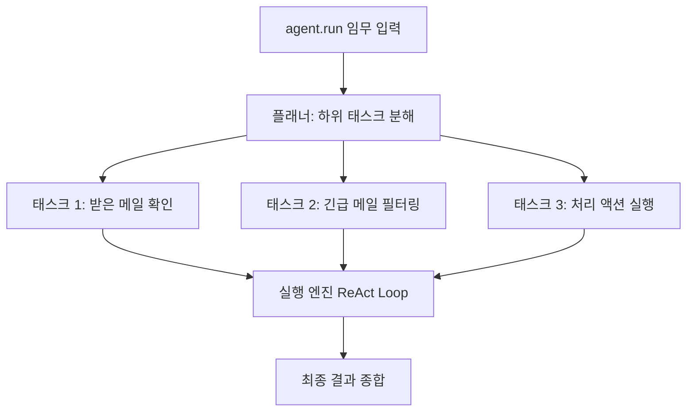

# 실습 3-1: 기본 DeepAgent

> 출처: [[26-03-11 ai-agent-framework-mastering]] — Module 3, 실습 3-1
> 파일: `module3_deepagents/01_basic_deep_agent.py`

---

## 핵심 개념

실습 2-1~2-2에서 80줄로 구현한 에이전트 루프를 **`create_deep_agent` 15줄로 대체**.

DeepAgents의 핵심 가치:
- 보일러플레이트 제거 (루프, 상태 관리, 도구 실행 모두 내장)
- **자동 플래닝**: 복잡한 임무를 스스로 하위 태스크로 분해
- 동일한 tools/system_prompt 인터페이스 유지

---

## 코드 구조 분해

### 1. create_deep_agent
```python
from deepagents import create_deep_agent

agent = create_deep_agent(
    model="claude-opus-4-5",
    tools=[check_inbox, send_email, search_emails],
    system_prompt="당신은 이메일 관리 전문가입니다..."
)
```
- `model`: Claude 모델 ID
- `tools`: LangChain Tool 객체 리스트 (실습 2-1/2-2와 동일)
- `system_prompt`: 에이전트의 역할과 행동 지침

### 2. 실행
```python
result = agent.run("받은 메일함을 확인하고 긴급 메일을 처리해줘")
print(result)
```
- `agent.run()` 한 줄로 전체 ReAct 루프 실행
- 내부적으로 플래닝 → 도구 선택 → 실행 → 반성 → 완료 판단

### 3. 실습 2-1과 기능 동일
```
실습 2-1: 80줄 (루프 + 도구 실행 + 메시지 누적 직접 구현)
실습 3-1: 15줄 (create_deep_agent 래핑)
결과: 동일
```

---

## 자동 플래닝 동작 방식



---

## 설계 포인트

| 포인트 | 설명 |
|--------|------|
| **동일 인터페이스** | tools/system_prompt는 2-1/2-2와 완전히 동일 → 마이그레이션 비용 없음 |
| **자동 플래닝** | 복잡한 임무를 명시적으로 분해하지 않아도 됨 |
| **내장 안전장치** | max_iterations, 에러 핸들링이 프레임워크 내부에 포함 |
| **추상화 트레이드오프** | 내부 동작이 숨겨짐 → 디버깅/커스터마이징 어려움 |

---

## 언제 DeepAgents vs LangGraph?

| 상황 | 선택 |
|------|------|
| 빠른 프로토타이핑 | DeepAgents (`create_deep_agent`) |
| 세밀한 상태 제어 필요 | LangGraph (`StateGraph`) |
| 체크포인팅 / HITL | LangGraph |
| 단순 태스크 자동화 | DeepAgents |
| 복잡한 다단계 워크플로우 | LangGraph |

실습 2-1/2-2는 "왜 DeepAgents가 편한지"를 이해하기 위한 밑바닥 학습이었다.
