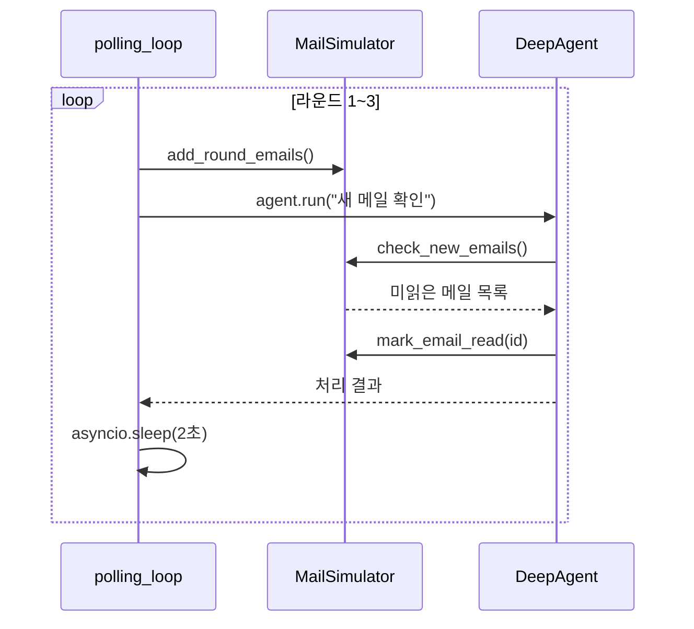

# 실습 3-2: 반복 폴링 Agent

> 출처: [[26-03-11 ai-agent-framework-mastering]] — Module 3, 실습 3-2
> 파일: `module3_deepagents/02_polling_agent.py`

---

## 핵심 개념

**Polling Agent**: 일정 간격으로 반복적으로 상태를 확인하고, 조건이 충족되면 액션을 취하는 에이전트.

- `MailSimulator`: 상태를 가진 이메일 시뮬레이터 (매 라운드 메일 추가)
- `asyncio.sleep`: 비동기 대기로 CPU를 블록하지 않음
- `mark_as_read`: 이미 처리한 메일 중복 처리 방지
- 3 라운드 폴링 후 자동 종료

---

## 코드 구조 분해

### 1. MailSimulator 클래스
```python
class MailSimulator:
    def __init__(self):
        self.emails = []
        self.round = 0

    def add_round_emails(self):
        """라운드마다 새 메일 추가"""
        self.round += 1
        if self.round == 1:
            self.emails.append({"id": "001", "subject": "일반 업무", "urgent": False})
        elif self.round == 2:
            self.emails.append({"id": "002", "subject": "긴급! 서버 장애", "urgent": True})
        elif self.round == 3:
            self.emails.append({"id": "003", "subject": "회의 일정", "urgent": False})

    def mark_as_read(self, email_id: str):
        """처리된 메일 상태 변경"""
        for email in self.emails:
            if email["id"] == email_id:
                email["read"] = True
```

### 2. 도구 정의
```python
simulator = MailSimulator()

@tool
def check_new_emails() -> list:
    """읽지 않은 메일 목록 반환"""
    return [e for e in simulator.emails if not e.get("read")]

@tool
def mark_email_read(email_id: str) -> str:
    """메일을 읽음으로 표시"""
    simulator.mark_as_read(email_id)
    return f"메일 {email_id} 처리 완료"
```

### 3. 비동기 폴링 루프
```python
async def polling_loop():
    agent = create_deep_agent(
        model="claude-haiku-4-5-20251001",
        tools=[check_new_emails, mark_email_read],
        system_prompt="새 메일을 확인하고 긴급 메일을 우선 처리하세요."
    )

    for round_num in range(1, 4):  # 3라운드
        simulator.add_round_emails()  # 새 메일 추가
        print(f"\n=== 라운드 {round_num} ===")

        result = agent.run("새 메일 확인 후 처리")
        print(result)

        await asyncio.sleep(2)  # 다음 폴링까지 2초 대기

asyncio.run(polling_loop())
```

---

## 실행 흐름



---

## 설계 포인트

| 포인트 | 설명 |
|--------|------|
| **asyncio.sleep** | 동기 `time.sleep`은 이벤트 루프를 블록. `await asyncio.sleep`은 양보 |
| **mark_as_read** | 폴링 중복 처리 방지. 멱등성(idempotency) 보장 |
| **MailSimulator 상태** | 라운드 간 상태 유지 (class 필드). 함수 밖에서 생성 후 클로저로 도구에 주입 |
| **Haiku 모델 선택** | 폴링처럼 반복 호출이 많은 경우 저렴한 모델이 적합 |

---

## 실전 확장 패턴

```python
# 실제 이메일 폴링 (Gmail API)
async def production_polling():
    while True:
        emails = gmail_api.get_unread()   # 실제 API 호출
        if emails:
            await agent.run(f"메일 {len(emails)}개 처리")
        await asyncio.sleep(300)  # 5분 간격
```

실습 2-4의 체크포인팅과 결합하면: 폴링 라운드 수, 처리한 메일 ID 목록을 영속 저장 → 프로세스 재시작 후에도 중복 처리 없이 재개 가능.
