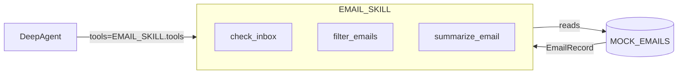

# 실습 4-1: Email Skill 모듈

> 출처: [[26-03-11 ai-agent-framework-mastering]] — Module 4, 실습 4-1
> 파일: `module4_skills_mcp/email_skill.py`

---

## 핵심 개념

**Skill 패턴**: 도메인 관련 도구들을 하나의 모듈로 묶어 재사용 가능한 단위로 패키징.

- `EmailRecord` dataclass: 구조화된 이메일 데이터 모델
- `MOCK_EMAILS`: 테스트용 인메모리 데이터
- 3개 도구 (`check_inbox`, `filter_emails`, `summarize_email`)를 하나의 `EMAIL_SKILL` dict에 번들링
- 에이전트에 Skill 단위로 꽂을 수 있어 모듈성↑

---

## 코드 구조 분해

### 1. 데이터 모델
```python
from dataclasses import dataclass

@dataclass
class EmailRecord:
    id: str
    sender: str
    subject: str
    body: str
    timestamp: str
    is_urgent: bool = False
    is_read: bool = False
```

### 2. 목 데이터
```python
MOCK_EMAILS: list[EmailRecord] = [
    EmailRecord("001", "ceo@company.com", "긴급 보고 요청", "...", "09:00", is_urgent=True),
    EmailRecord("002", "hr@company.com", "복지 안내", "...", "10:00"),
    EmailRecord("003", "dev@company.com", "서버 장애 알림", "...", "11:00", is_urgent=True),
]
```

### 3. 도구 3종
```python
@tool
def check_inbox() -> str:
    """받은 메일함의 전체 메일 목록 반환"""
    unread = [e for e in MOCK_EMAILS if not e.is_read]
    return json.dumps([{"id": e.id, "subject": e.subject, "urgent": e.is_urgent}
                       for e in unread], ensure_ascii=False)

@tool
def filter_emails(urgent_only: bool = False) -> str:
    """조건에 따라 메일 필터링"""
    emails = MOCK_EMAILS
    if urgent_only:
        emails = [e for e in emails if e.is_urgent]
    return json.dumps([{"id": e.id, "subject": e.subject} for e in emails], ensure_ascii=False)

@tool
def summarize_email(email_id: str) -> str:
    """특정 메일의 상세 요약 반환"""
    email = next((e for e in MOCK_EMAILS if e.id == email_id), None)
    if not email:
        return f"메일 ID {email_id}를 찾을 수 없습니다."
    return f"발신자: {email.sender}\n제목: {email.subject}\n내용: {email.body}"
```

### 4. Skill 번들
```python
EMAIL_SKILL = {
    "name": "email_management",
    "description": "이메일 관리 스킬 — 받은 메일 확인, 필터링, 요약",
    "tools": [check_inbox, filter_emails, summarize_email],
    "version": "1.0.0"
}
```

---

## 아키텍처 다이어그램



---

## 설계 포인트

| 포인트 | 설명 |
|--------|------|
| **dataclass** | dict보다 타입 안전하고, 필드 자동완성 가능 |
| **JSON 출력** | LLM이 파싱하기 쉽도록 구조화된 문자열 반환 |
| **ensure_ascii=False** | 한글 포함 텍스트가 깨지지 않도록 |
| **Skill dict** | 도구 목록 + 메타데이터(이름, 설명, 버전)를 하나의 단위로 관리 |

---

## Skill 패턴의 장점

```
일반적 방식:
  agent = create_deep_agent(tools=[t1, t2, t3, t4, t5, t6, ...])

Skill 방식:
  agent = create_deep_agent(
      tools=[*EMAIL_SKILL["tools"], *CALENDAR_SKILL["tools"]]
  )
```

도메인별 Skill 모듈을 조합해 에이전트를 구성. 다음 실습(4-2, 4-3)에서는 이 Skill을 MCP 서버로 네트워크에 노출한다.
