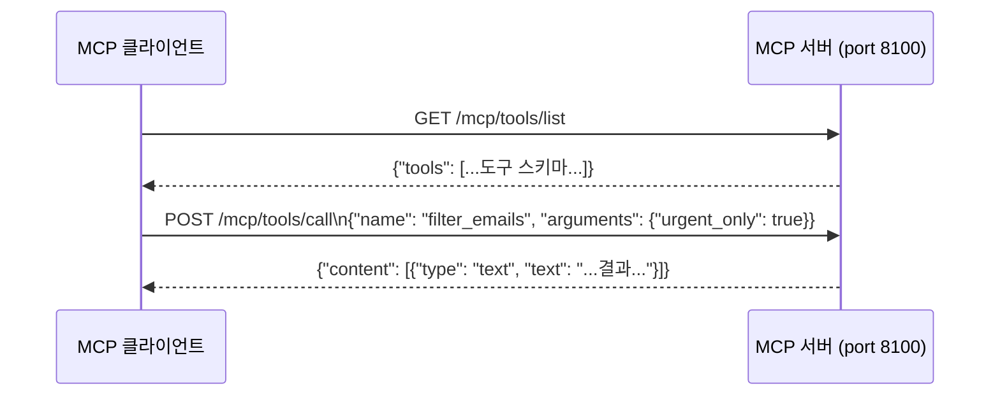

# 실습 4-2: 간이 MCP 서버

> 출처: [[26-03-11 ai-agent-framework-mastering]] — Module 4, 실습 4-2
> 파일: `module4_skills_mcp/mcp_mail_server.py`

---

## 핵심 개념

**MCP (Model Context Protocol)**: AI 에이전트가 외부 도구를 HTTP로 호출하기 위한 표준 프로토콜.

Starlette 경량 HTTP 서버로 MCP 서버를 직접 구현:
- `GET /mcp/tools/list` → 사용 가능한 도구 목록 반환
- `POST /mcp/tools/call` → 특정 도구 실행

이 서버는 포트 8100에서 실행되며, 실습 4-3의 클라이언트가 여기에 연결한다.

---

## 코드 구조 분해

### 1. 도구 정의 스키마
```python
TOOL_DEFINITIONS = [
    {
        "name": "check_inbox",
        "description": "받은 메일함 확인",
        "inputSchema": {
            "type": "object",
            "properties": {},
            "required": []
        }
    },
    {
        "name": "filter_emails",
        "description": "이메일 필터링",
        "inputSchema": {
            "type": "object",
            "properties": {
                "urgent_only": {
                    "type": "boolean",
                    "description": "긴급 메일만 필터링"
                }
            },
            "required": []
        }
    },
    {
        "name": "summarize_email",
        "description": "메일 상세 요약",
        "inputSchema": {
            "type": "object",
            "properties": {
                "email_id": {"type": "string", "description": "메일 ID"}
            },
            "required": ["email_id"]
        }
    }
]
```

### 2. 도구 실행 디스패처
```python
def execute_tool(tool_name: str, arguments: dict) -> dict:
    if tool_name == "check_inbox":
        result = check_inbox()
    elif tool_name == "filter_emails":
        urgent_only = arguments.get("urgent_only", False)
        result = filter_emails(urgent_only=urgent_only)
    elif tool_name == "summarize_email":
        email_id = arguments.get("email_id")
        result = summarize_email(email_id=email_id)
    else:
        raise ValueError(f"알 수 없는 도구: {tool_name}")

    return {"content": [{"type": "text", "text": result}]}
```

### 3. HTTP 엔드포인트
```python
from starlette.applications import Starlette
from starlette.routing import Route
from starlette.responses import JSONResponse

async def list_tools(request):
    return JSONResponse({"tools": TOOL_DEFINITIONS})

async def call_tool(request):
    body = await request.json()
    tool_name = body["name"]
    arguments = body.get("arguments", {})
    result = execute_tool(tool_name, arguments)
    return JSONResponse(result)

app = Starlette(routes=[
    Route("/mcp/tools/list", list_tools, methods=["GET"]),
    Route("/mcp/tools/call", call_tool, methods=["POST"]),
])
```

### 4. 서버 실행
```python
import uvicorn
uvicorn.run(app, host="0.0.0.0", port=8100)
```

---

## MCP 프로토콜 흐름



---

## 설계 포인트

| 포인트 | 설명 |
|--------|------|
| **inputSchema** | JSON Schema 형식. 클라이언트가 인자 타입을 미리 알 수 있음 |
| **디스패처 패턴** | `if/elif`로 도구 이름 → 함수 매핑. 도구 추가 시 여기에 분기 추가 |
| **content 배열** | MCP 응답 형식. `type: "text"` 외 `image`, `resource` 등 가능 |
| **Starlette** | FastAPI보다 가볍고 비동기 지원. MCP 서버 같은 단순 HTTP API에 적합 |

---

## 실제 MCP 서버와의 차이

이 실습은 MCP 프로토콜의 핵심 부분만 구현한 **간이 버전**. 실제 MCP 서버는:
- `stdio` 또는 `SSE` 트랜스포트 지원
- JSON-RPC 2.0 형식 사용
- 인증/보안 레이어 포함

Python용 공식 MCP SDK: `pip install mcp`를 사용하면 프로토콜 세부사항을 추상화해서 사용 가능.
