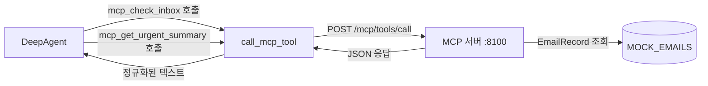

# 실습 4-3: Skill + MCP 통합

> 출처: [[26-03-11 ai-agent-framework-mastering]] — Module 4, 실습 4-3
> 파일: `module4_skills_mcp/skill_with_mcp.py`

---

## 핵심 개념

**MCP 클라이언트 Skill**: 실습 4-2의 MCP 서버를 HTTP로 호출하는 래퍼 함수를 LangChain Tool로 패키징.

핵심 패턴:
- `call_mcp_tool()`: httpx로 MCP 서버에 HTTP 요청하는 공통 헬퍼
- 각 MCP 도구를 LangChain `@tool`로 래핑 → 에이전트가 직접 호출 가능
- `mcp_get_urgent_summary()`: filter → summarize 연쇄 호출 (Skill 내부 체이닝)

---

## 코드 구조 분해

### 1. MCP 호출 헬퍼
```python
import httpx

MCP_SERVER_URL = "http://localhost:8100"

def call_mcp_tool(tool_name: str, arguments: dict = {}) -> str:
    """MCP 서버의 도구를 HTTP로 호출하는 공통 헬퍼"""
    response = httpx.post(
        f"{MCP_SERVER_URL}/mcp/tools/call",
        json={"name": tool_name, "arguments": arguments}
    )
    result = response.json()
    # MCP 응답 정규화: content[0].text 추출
    return result["content"][0]["text"]
```

### 2. MCP 도구를 LangChain Tool로 래핑
```python
@tool
def mcp_check_inbox() -> str:
    """MCP 서버를 통해 받은 메일함 확인"""
    raw = call_mcp_tool("check_inbox")
    # 원시 JSON을 사람이 읽기 좋은 보고서로 정규화
    emails = json.loads(raw)
    report = f"총 {len(emails)}개 메일\n"
    for e in emails:
        flag = "🚨" if e["urgent"] else "📧"
        report += f"{flag} [{e['id']}] {e['subject']}\n"
    return report
```

### 3. 연쇄 호출 (Skill 체이닝)
```python
@tool
def mcp_get_urgent_summary() -> str:
    """긴급 메일 필터링 후 각 메일 요약 — 두 MCP 도구를 연쇄 호출"""
    # Step 1: 긴급 메일 필터링
    filtered_raw = call_mcp_tool("filter_emails", {"urgent_only": True})
    urgent_emails = json.loads(filtered_raw)

    if not urgent_emails:
        return "긴급 메일 없음"

    # Step 2: 각 메일 요약 (연쇄 호출)
    summaries = []
    for email in urgent_emails:
        summary = call_mcp_tool("summarize_email", {"email_id": email["id"]})
        summaries.append(f"=== {email['subject']} ===\n{summary}")

    return "\n\n".join(summaries)
```

### 4. 에이전트에 Skill 등록
```python
agent = create_deep_agent(
    model="claude-haiku-4-5-20251001",
    tools=[mcp_check_inbox, mcp_get_urgent_summary],
    system_prompt="MCP 서버를 통해 이메일을 관리하세요."
)
result = agent.run("긴급 메일 확인 후 요약해줘")
```

---

## 아키텍처 흐름



---

## 설계 포인트

| 포인트 | 설명 |
|--------|------|
| **call_mcp_tool 공통 헬퍼** | 모든 MCP 호출이 한 함수를 통과 → 에러 처리, 로깅, 인증을 한 곳에서 관리 |
| **응답 정규화** | MCP 원시 응답(JSON) → LLM이 읽기 쉬운 텍스트 변환. Skill 레이어의 핵심 역할 |
| **Skill 내부 체이닝** | `mcp_get_urgent_summary`는 두 MCP 도구를 순차 호출. 에이전트는 단일 도구처럼 사용 |
| **서버 분리** | Skill(클라이언트)과 MCP 서버가 분리 → 서버를 교체해도 Skill 코드 불변 |

---

## 3개 실습의 관계

```
실습 4-1 Email Skill   ─┐
                         ├→ MCP 서버 내부 구현 (실습 4-2)
실습 4-2 MCP 서버      ─┘      ↑ HTTP
                                │
실습 4-3 Skill+MCP    ─→  MCP 클라이언트 Skill → DeepAgent
```

다음 모듈(5-1, 5-2)에서는 이 MCP 서버 위에 **A2A (Agent-to-Agent)** 레이어를 추가한다.
