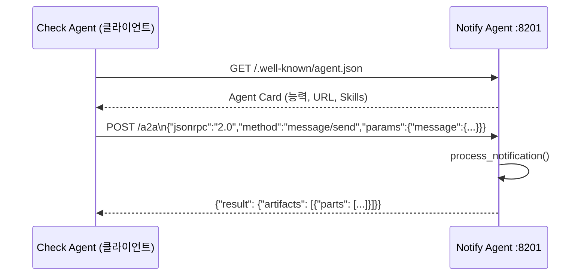

# 실습 5-1: Notify Agent — A2A 서버

> 출처: [[26-03-11 ai-agent-framework-mastering]] — Module 5, 실습 5-1
> 파일: `module5_a2a/notify_agent_server.py`

---

## 핵심 개념

**A2A (Agent-to-Agent) Protocol**: 에이전트가 다른 에이전트를 HTTP로 호출하는 표준.

- **Agent Card**: `/.well-known/agent.json`에 에이전트 자기소개 문서를 게시
- **message/send**: JSON-RPC 형식으로 Task를 받아 처리 후 Artifact 반환
- Notify Agent는 이메일 알림을 담당하는 전문가 에이전트

이 서버는 포트 8201에서 실행. 실습 5-2의 Check Agent가 여기에 연결한다.

---

## 코드 구조 분해

### 1. Agent Card
```python
AGENT_CARD = {
    "name": "NotifyAgent",
    "description": "이메일 알림 처리 전문 에이전트",
    "version": "1.0.0",
    "url": "http://localhost:8201",
    "capabilities": {
        "streaming": False,
        "pushNotifications": False
    },
    "skills": [
        {
            "id": "send_notification",
            "name": "알림 전송",
            "description": "긴급 이메일 내용을 받아 알림 메시지 생성 및 전송"
        }
    ]
}
```
- `/.well-known/agent.json` 경로에 게시 → 다른 에이전트가 discovery 가능

### 2. A2A 메시지 처리
```python
async def handle_a2a(request):
    body = await request.json()
    method = body.get("method")   # JSON-RPC method 필드

    if method == "message/send":
        task_data = body.get("params", {}).get("message", {})
        result = process_notification(task_data)
        return JSONResponse({
            "jsonrpc": "2.0",
            "id": body.get("id"),
            "result": result
        })
    else:
        return JSONResponse({"error": f"지원하지 않는 메서드: {method}"}, status_code=400)
```

### 3. 알림 처리 로직
```python
def process_notification(task_data: dict) -> dict:
    """수신한 Task에서 텍스트 추출 → 알림 생성 → Artifact 반환"""
    # Task에서 텍스트 추출
    parts = task_data.get("parts", [])
    content = " ".join(p.get("text", "") for p in parts if p.get("type") == "text")

    # 알림 메시지 생성
    notification_msg = f"[NotifyAgent] 긴급 이메일 알림:\n{content}\n→ 관련 팀에 알림 전송 완료"

    # Artifact 형식으로 반환
    return {
        "artifacts": [{
            "parts": [{"type": "text", "text": notification_msg}]
        }]
    }
```

### 4. 라우팅
```python
app = Starlette(routes=[
    Route("/.well-known/agent.json", get_agent_card, methods=["GET"]),
    Route("/a2a", handle_a2a, methods=["POST"]),
])

uvicorn.run(app, host="0.0.0.0", port=8201)
```

---

## A2A 프로토콜 흐름



---

## 설계 포인트

| 포인트 | 설명 |
|--------|------|
| **Agent Card** | `/.well-known/` 경로 표준화 → 자동 discovery 가능 |
| **JSON-RPC 2.0** | `method`, `params`, `id` 구조. 동일 엔드포인트에서 여러 method 처리 |
| **Task/Artifact** | A2A 데이터 단위. Task(입력) → Artifact(출력) |
| **parts 배열** | 텍스트 외 이미지, 파일 등 멀티모달 콘텐츠 지원을 위한 구조 |

---

## A2A vs MCP 비교

| 항목 | MCP | A2A |
|------|-----|-----|
| 대상 | 도구(Tool) 호출 | 에이전트 간 통신 |
| 단위 | Tool + inputSchema | Task + Artifact |
| Discovery | tools/list | /.well-known/agent.json |
| 프로토콜 | 자체 HTTP | JSON-RPC 2.0 |
| 주체 | LLM ↔ 도구 | 에이전트 ↔ 에이전트 |
