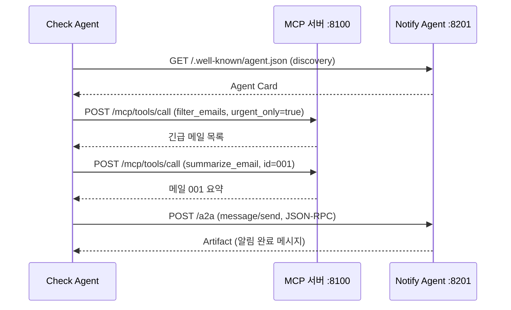

# 실습 5-2: Check Agent — A2A 클라이언트

> 출처: [[26-03-11 ai-agent-framework-mastering]] — Module 5, 실습 5-2
> 파일: `module5_a2a/check_agent_client.py`

---

## 핵심 개념

**Check Agent**: MCP 서버에서 이메일을 수집하고, A2A 프로토콜로 Notify Agent에게 알림 처리를 위임하는 3단계 파이프라인.

```
[Check Agent]
    ↓ (1) MCP 서버에서 메일 수집
    ↓ (2) 긴급 메일 선별
    ↓ (3) A2A로 Notify Agent에게 알림 위임
```

---

## 코드 구조 분해

### 1. Notify Agent 자동 Discovery
```python
NOTIFY_AGENT_URL = "http://localhost:8201"

def discover_agent(agent_url: str) -> dict:
    """Agent Card를 조회해 에이전트 능력 확인"""
    response = httpx.get(f"{agent_url}/.well-known/agent.json")
    agent_card = response.json()
    print(f"발견된 에이전트: {agent_card['name']}")
    print(f"제공 스킬: {[s['name'] for s in agent_card['skills']]}")
    return agent_card
```

### 2. MCP 서버에서 긴급 메일 수집
```python
MCP_SERVER_URL = "http://localhost:8100"

def check_mail_via_mcp() -> list[dict]:
    """MCP 서버를 호출해 긴급 메일 목록 반환"""
    # 긴급 메일 필터링
    filter_resp = httpx.post(f"{MCP_SERVER_URL}/mcp/tools/call",
        json={"name": "filter_emails", "arguments": {"urgent_only": True}})
    urgent_emails = json.loads(filter_resp.json()["content"][0]["text"])

    # 각 메일 상세 조회
    result = []
    for email in urgent_emails:
        summary_resp = httpx.post(f"{MCP_SERVER_URL}/mcp/tools/call",
            json={"name": "summarize_email", "arguments": {"email_id": email["id"]}})
        summary = summary_resp.json()["content"][0]["text"]
        result.append({"id": email["id"], "subject": email["subject"], "summary": summary})

    return result
```

### 3. A2A로 Notify Agent에게 알림 위임
```python
def send_to_notify_agent(agent_url: str, email_summaries: list[dict]) -> str:
    """A2A JSON-RPC로 Notify Agent에게 Task 전송"""
    content = "\n\n".join(
        f"제목: {e['subject']}\n{e['summary']}" for e in email_summaries
    )

    payload = {
        "jsonrpc": "2.0",
        "method": "message/send",
        "id": "check-agent-001",
        "params": {
            "message": {
                "parts": [{"type": "text", "text": content}]
            }
        }
    }

    response = httpx.post(f"{agent_url}/a2a", json=payload)
    result = response.json()
    return result["result"]["artifacts"][0]["parts"][0]["text"]
```

### 4. 메인 파이프라인
```python
def main():
    # Step 1: Notify Agent 발견
    agent_card = discover_agent(NOTIFY_AGENT_URL)

    # Step 2: MCP에서 긴급 메일 수집
    urgent_emails = check_mail_via_mcp()
    print(f"긴급 메일 {len(urgent_emails)}개 발견")

    # Step 3: A2A로 알림 위임
    notification_result = send_to_notify_agent(NOTIFY_AGENT_URL, urgent_emails)
    print(notification_result)
```

---

## E2E 파이프라인 흐름



---

## 설계 포인트

| 포인트 | 설명 |
|--------|------|
| **Discovery 먼저** | Agent Card 조회로 에이전트 능력 확인 후 호출 → 하드코딩 의존 제거 |
| **MCP + A2A 분리** | 데이터 수집(MCP) vs 에이전트 협업(A2A) 역할 명확히 구분 |
| **JSON-RPC id** | 요청-응답 매핑을 위한 식별자. 비동기 환경에서 중요 |
| **콘텐츠 정규화** | 여러 메일 요약을 하나의 텍스트로 합쳐 Task 생성 |

---

## 실습 5-1 + 5-2 전체 아키텍처

```
[실습 4-2 MCP 서버 :8100]
        ↑ HTTP (MCP)
[실습 5-2 Check Agent] → [실습 5-1 Notify Agent :8201]
                              (A2A JSON-RPC)
```

다음 실습(6-1)은 이 전체 파이프라인을 하나의 E2E 데모로 통합하고, HITL 포인트를 추가한다.
