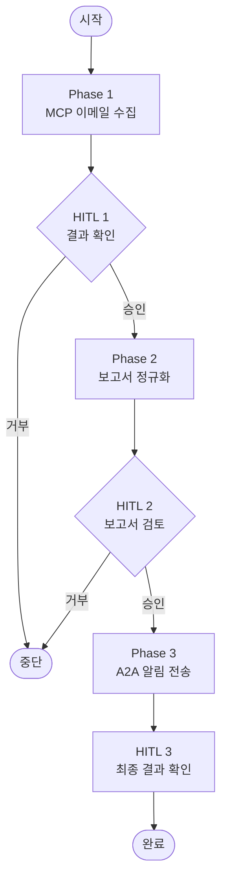

# 실습 6-1: End-to-End 데모 + HITL

> 출처: [[26-03-11 ai-agent-framework-mastering]] — Module 6, 실습 6-1
> 파일: `module6_integration/e2e_demo.py`

---

## 핵심 개념

모듈 2~5의 모든 구성요소를 하나의 파이프라인으로 통합한 최종 데모.

```
Phase 1: MCP 서버에서 이메일 수집
Phase 2: 수집된 데이터 정규화 및 보고서 생성
Phase 3: A2A 프로토콜로 Notify Agent에 알림 전송
```

추가로 **HITL(Human-in-the-Loop)** 패턴 3가지 삽입 포인트를 보여준다.

---

## 코드 구조 분해

### Phase 1: MCP 이메일 수집
```python
def phase1_check_mail() -> dict:
    """MCP 서버에서 긴급 이메일 수집"""
    # 긴급 메일 필터링
    filter_resp = httpx.post(f"{MCP_URL}/mcp/tools/call",
        json={"name": "filter_emails", "arguments": {"urgent_only": True}})
    urgent = json.loads(filter_resp.json()["content"][0]["text"])

    # 각 메일 상세 조회
    emails = []
    for e in urgent:
        summary_resp = httpx.post(f"{MCP_URL}/mcp/tools/call",
            json={"name": "summarize_email", "arguments": {"email_id": e["id"]}})
        emails.append({
            "id": e["id"],
            "subject": e["subject"],
            "summary": summary_resp.json()["content"][0]["text"]
        })

    return {"urgent_count": len(emails), "emails": emails}
```

### Phase 2: 보고서 정규화
```python
def phase2_generate_report(mail_data: dict) -> str:
    """수집된 이메일 데이터를 알림용 보고서로 변환"""
    lines = [f"긴급 이메일 {mail_data['urgent_count']}건 감지\n"]
    for e in mail_data["emails"]:
        lines.append(f"📧 [{e['id']}] {e['subject']}")
        lines.append(e["summary"])
        lines.append("---")
    return "\n".join(lines)
```

### Phase 3: A2A 알림 전송
```python
def phase3_notify_via_a2a(report: str) -> str:
    """A2A 프로토콜로 Notify Agent에게 알림 처리 위임"""
    payload = {
        "jsonrpc": "2.0",
        "method": "message/send",
        "id": "e2e-demo-001",
        "params": {
            "message": {"parts": [{"type": "text", "text": report}]}
        }
    }
    response = httpx.post(f"{NOTIFY_AGENT_URL}/a2a", json=payload)
    return response.json()["result"]["artifacts"][0]["parts"][0]["text"]
```

### HITL 체크포인트 함수
```python
def hitl_checkpoint(stage: str, data: any, auto_approve: bool = False) -> bool:
    """Human-in-the-Loop 승인 포인트"""
    print(f"\n{'='*50}")
    print(f"[HITL] {stage}")
    print(f"데이터 미리보기: {str(data)[:200]}...")
    print('='*50)

    if auto_approve:
        print("자동 승인 모드: 진행")
        return True

    response = input("계속 진행하시겠습니까? (y/n): ").strip().lower()
    return response == 'y'
```

### 메인 파이프라인
```python
def main(auto_approve=False):
    # Phase 1: 이메일 수집
    mail_data = phase1_check_mail()

    # HITL 포인트 1: 수집 결과 확인 후 계속 여부
    if not hitl_checkpoint("Phase 1 완료: 이메일 수집", mail_data, auto_approve):
        print("사용자가 중단을 요청했습니다."); return

    # Phase 2: 보고서 생성
    report = phase2_generate_report(mail_data)

    # HITL 포인트 2: 보고서 내용 검토 후 알림 전송 여부
    if not hitl_checkpoint("Phase 2 완료: 보고서 생성", report, auto_approve):
        print("보고서 검토 후 중단"); return

    # Phase 3: A2A 알림
    result = phase3_notify_via_a2a(report)

    # HITL 포인트 3: 최종 결과 확인
    hitl_checkpoint("Phase 3 완료: 알림 전송", result, auto_approve)
    print(f"\n최종 결과:\n{result}")
```

---

## 전체 E2E 흐름



---

## HITL LangGraph 패턴 (참고)

LangGraph의 공식 HITL 구현:

```python
from langgraph.types import interrupt

def human_review_node(state):
    """LangGraph interrupt로 실행 일시정지 → 사람 검토 대기"""
    result = interrupt({
        "question": "이 보고서를 전송하시겠습니까?",
        "report": state["report"]
    })
    # 사람이 승인하면 result["approved"] == True
    return {"approved": result.get("approved", False)}
```

- `interrupt()`: 그래프 실행을 일시정지하고 외부 입력 대기
- 재개 시 `app.invoke(Command(resume={"approved": True}), config)` 호출
- 체크포인팅과 결합하면 며칠 후에도 재개 가능

---

## 모듈별 레이어 정리

| 레이어 | 구성요소 | 실습 |
|--------|---------|------|
| **실행 엔진** | LangChain Agent Loop, LangGraph StateGraph | 2-1 ~ 2-4 |
| **프레임워크** | DeepAgents (create_deep_agent, polling) | 3-1 ~ 3-2 |
| **도구 모듈화** | Skill 패턴, MCP 서버/클라이언트 | 4-1 ~ 4-3 |
| **에이전트 협업** | A2A 서버/클라이언트 | 5-1 ~ 5-2 |
| **통합 + HITL** | E2E 파이프라인, Human-in-the-Loop | 6-1 |
